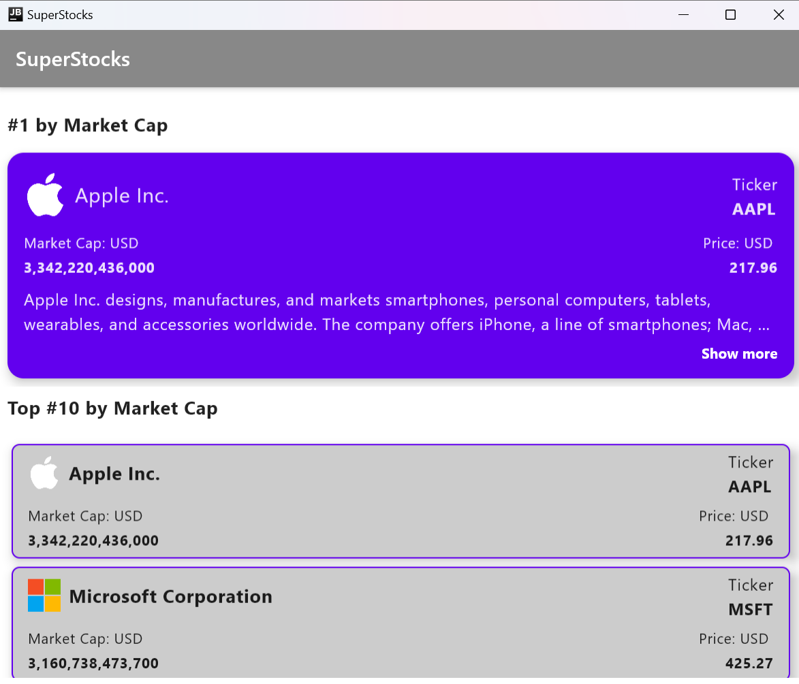

# SuperStocks
SuperStocks is a compose multiplatform project that gets Realtime data for the top #10 companies around the world, by market capitalization. I am getting the data from the [Financial Modelling Prep (FMP) API:](https://site.financialmodelingprep.com/) 

## Built with?
### Development Environment
- Android Studio Koala | 2024.1.1 Patch 1
### Libraries
- [Kamel](https://github.com/Kamel-Media/Kamel) - for Loading Images 
- [Ktor](https://github.com/ktorio/ktor ) – for network calls 
- [Kotlinx serialization](https://github.com/Kotlin/kotlinx.serialization) – for serialization and deserializing objects of custom types  
- [Moko mvvm](https://github.com/icerockdev/moko-mvvm ) – for the apps architecture components (MVVM) 
- [Kotlinx coroutines](https://github.com/Kotlin/kotlinx.coroutines ) – for asynchronous tasks 
- [Precompose](https://github.com/Tlaster/PreCompose ) – for navigation within the App 

## Screenshots 
### Android
|   |   |   |  |
|:-------------------------------:|:-------------------------------:|:-------------------------------:|:------------------------------:|

### Desktop
|  |  |  |
|:-------------------------------:|:-------------------------------:|:-------------------------------:|

## Want to test the project ? 
- Clone the Repository on your local machine 
- For Android: 
  - Select composeApp in the run configurations and click run
- For desktop: 
  - In the run configurations select edit configurations 
  - Click the plus icon and select Gradle from the options 
  - Paste this command in the tasks and arguments field and click ok 
```
desktopRun -DmainClass=MainKt --quiet 
```
  - Run the new desktopRun configuration 

## Resources that Came In Handy
- [Create a Compose Multiplatform app — tutorial](https://www.jetbrains.com/help/kotlin-multiplatform-dev/compose-multiplatform-getting-started.html ) 
- [Build Apps for iOS, Android, and Desktop With Compose Multiplatform](https://www.youtube.com/watch?v=IGuVIRZzVTk&t=124s) 
- [Create a multiplatform app using Ktor and SQLDelight](https://www.jetbrains.com/help/kotlin-multiplatform-dev/multiplatform-ktor-sqldelight.html) 
